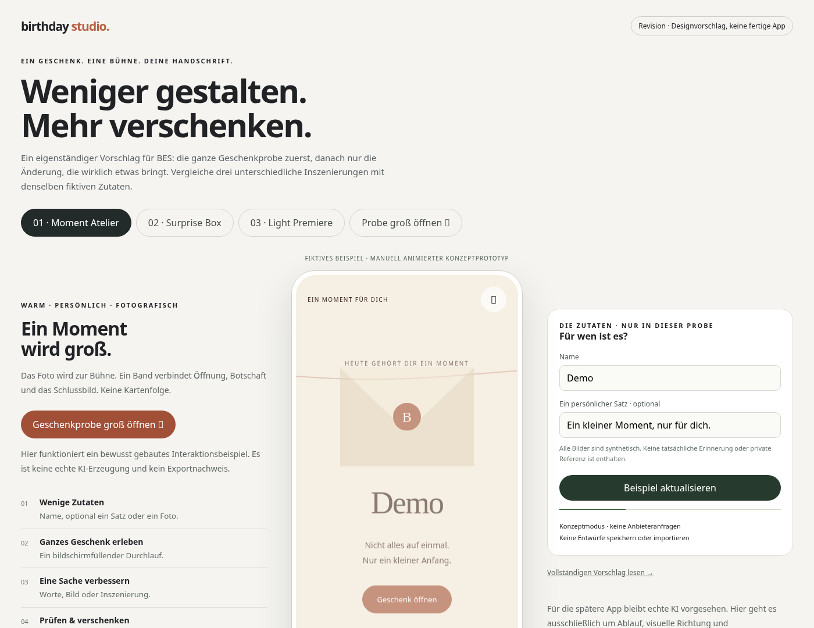
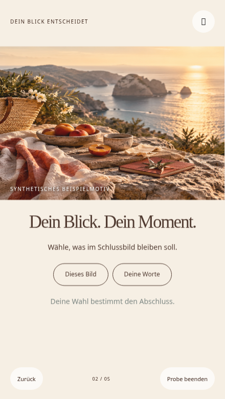
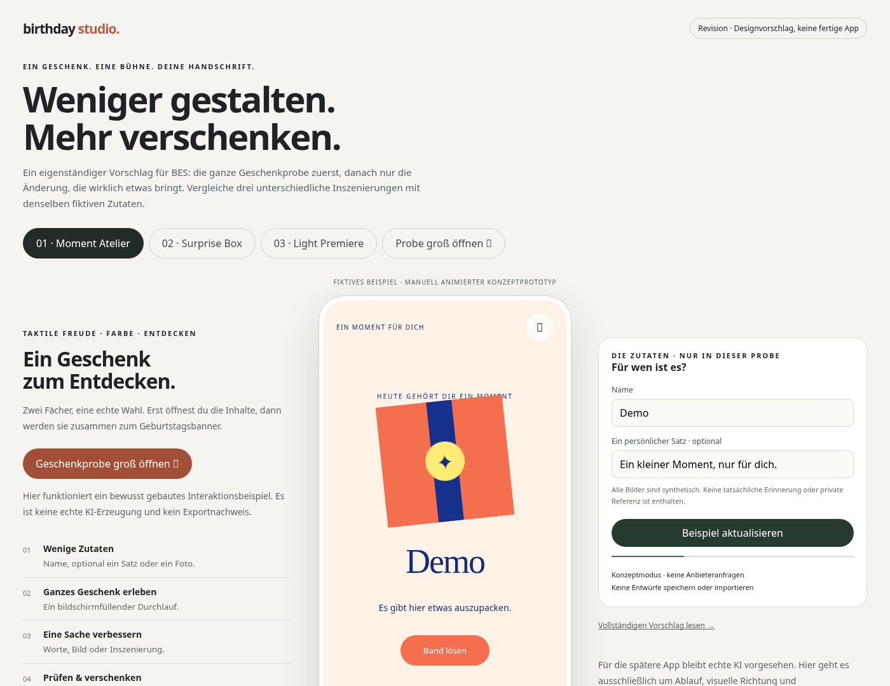
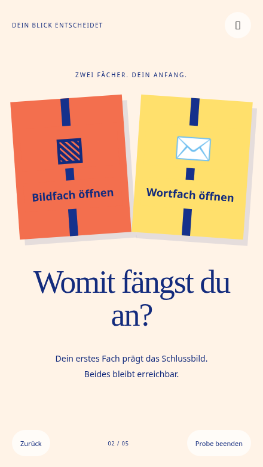
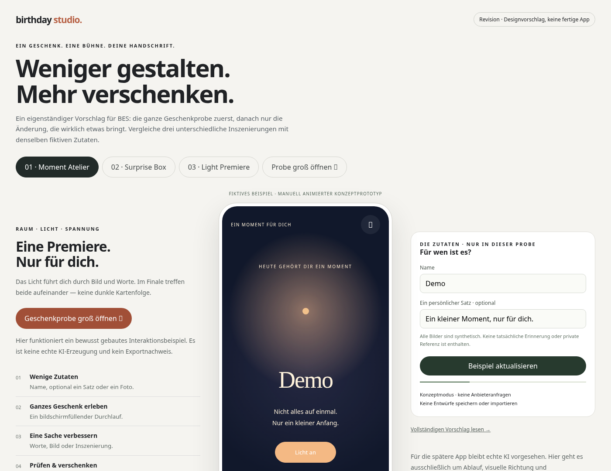
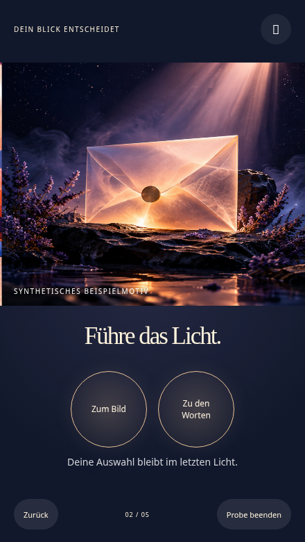

# Drei Richtungen zum Ansehen

**Konzeptmaterial, kein Produktrelease.** Alle Motive sind neu erzeugte synthetische Fotografien. Keine privaten Referenzinhalte, echten Personen oder echten Erinnerungen. Die Filme zeigen bewusst geschriebene Designanimationen und deterministisch geschnittene Szenen; sie zeigen keine KI-Inferenz, reale Empfängerreaktion oder iPhone-Dateiöffnung.

[Das klickbare Konzeptstudio](konzeptstudio.html) lässt sich als einzelne HTML-Datei herunterladen und in einem Desktop-Browser öffnen. Es benötigt kein Netzwerk. Unter „Probe groß öffnen“ sind Öffnen, Auswahl, Botschaft, Abschluss, Zurück und Replay tatsächlich bedienbar. Der Prototyp ist ein visuelles Entscheidungswerkzeug; er speichert keine Projekte, verbindet keinen Provider und exportiert kein Produktgeschenk.

## A · Moment Atelier — Empfehlung

Warme fotografische Bühne, Papier und ein durchgängiges Bandmotiv. Eine Auswahl bewahrt Bild oder Worte im Schlussbild.





[45-Sekunden-Film, MP4](visuals/editorial-film.mp4) · [45-Sekunden-GIF](visuals/editorial-film.gif) · [Finale](visuals/editorial-finale.png)

## B · Surprise Box — stärkster Challenger

Ultramarin und Koralle. Zwei echte auswählbare Papierfächer; ein Banner und eine kurze Konfettiwolke statt derselben Premium-Karte mit anderer Farbe.





[45-Sekunden-Film, MP4](visuals/play-film.mp4) · [45-Sekunden-GIF](visuals/play-film.gif) · [Finale](visuals/play-finale.png)

## C · Light Premiere — Experiment

Ein durchgängiger dunkler Lichtraum, Auswahl des beleuchteten Inhalts und ein ruhender Briefmoment. Die persönliche Substanz muss die Kinoinszenierung tragen.





[45-Sekunden-Film, MP4](visuals/cinema-film.mp4) · [45-Sekunden-GIF](visuals/cinema-film.gif) · [Finale](visuals/cinema-finale.png)

## Reproduktion

Nach `npm ci` im Repository:

```sh
node docs/revision-v2/check-concept.mjs
node docs/revision-v2/check-concept.mjs --webkit
node docs/revision-v2/render-visuals.mjs editorial
node docs/revision-v2/render-visuals.mjs play
node docs/revision-v2/render-visuals.mjs cinema
```

Playwright-Browser müssen installiert sein. Bei vorhandenen Systembrowsern lassen sich `PLAYWRIGHT_CHROMIUM_EXECUTABLE_PATH` beziehungsweise `PLAYWRIGHT_WEBKIT_EXECUTABLE_PATH` verwenden. Der Renderer schreibt die Screenshotübersicht und pro Richtung 360 Filmframes nach `/tmp/bes-revision-frames/<Richtung>/`. Acht Frames pro Sekunde über 45 Sekunden sind eine Storyboard-Demonstration, keine Messung der späteren App-Framerate.

Beispiel für das MP4 mit installiertem FFmpeg:

```sh
ffmpeg -framerate 8 -i /tmp/bes-revision-frames/editorial/%04d.png -vf 'fps=24,format=yuv420p' -c:v libx264 -crf 22 -movflags +faststart editorial-film.mp4
```

Die 24 fps im MP4 wiederholen Frames; sie erhöhen die tatsächliche zeitliche Auflösung nicht. GIFs starten je nach Viewer automatisch und haben keine eigenen Pause-Regler; für reduzierte Bewegung die statischen Bilder oder das steuerbare MP4 wählen.
